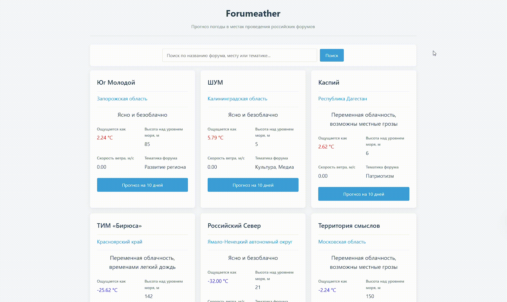

# Forumeather

**Forumeather** — это приложение на языке Go, предназначенное для отслеживания молодежных форумов и получения актуального прогноза погоды в местах их проведения. Проект объединяет в себе базу данных форумов и интеграцию с погодным сервисом Meteoblue.



## Суть проекта

Приложение позволяет хранить информацию о различных форумах (название, место проведения, тематика, координаты) и просматривать текущую погоду или тренд на день для этих локаций. Проект состоит из двух основных частей:

1. **Web-интерфейс**: для наглядного отображения списка форумов и погоды.
2. **CLI-инструмент**: для административного управления списком форумов (добавление, удаление, просмотр).

## Основные особенности

* **Интеграция с Meteoblue API**: получение детального прогноза погоды по координатам форума.
* **Управление данными**: полноценный CLI-интерфейс для работы с базой данных SQLite.
* **Контейнеризация**: наличие Docker-конфигураций для быстрого развертывания как веб-приложения, так и консольной утилиты.
* **Готовая база данных**: проект включает SQL-скрипт с предустановленным списком крупнейших молодежных форумов России, таких как «Территория смыслов», «Таврида.АРТ», «Машук» и другие.

## Структура проекта

* `cmd/web/` — точка входа и логика веб-сервера.
* `cmd/cli/` — консольная утилита для управления базой данных.
* `pkg/meteoblue/` — клиент для работы с API прогноза погоды.
* `pkg/storage/` — логика взаимодействия с базой данных SQLite.
* `pkg/config/` — управление конфигурацией и флагами запуска.
* `initial_script_db.sql` — SQL-скрипт для инициализации структуры БД и наполнения её начальными данными.

## Технологический стек

* **Язык программирования**: Go 1.23.2.
* **База данных**: SQLite 3.
* **API**: Meteoblue.
* **Развертывание**: Docker, Docker Compose.

## Как запустить

### Предварительные требования

* Установленный **Go** (версия 1.23.2 или выше).
* Установленный **Docker** и **Docker Compose** (для запуска в контейнерах).
* **API ключ Meteoblue** (можно использовать стандартный из конфига, но он выдает пустой результат при запросе).

### Запуск через Docker Compose (рекомендуется)

Самый быстрый способ запустить проект — использовать Docker Compose, который автоматически соберет и настроит веб-приложение и CLI-инструмент:

```bash
docker-compose up --build

```

После запуска веб-интерфейс будет доступен по адресу: `http://localhost:8080`.

### Ручной запуск (без Docker)

1. **Запуск веб-сервера**:
```bash
go run ./cmd/web/ --port=:8080 --api-key=ВАШ_КЛЮЧ

```

*Флаги `--port` и `--api-key` являются необязательными и имеют значения по умолчанию*.

3. **Запуск CLI-инструмента**:
```bash
go run ./cmd/cli/

```


## Использование CLI-инструмента

При запуске консольной утилиты вам будет предложено ввести код операции:

* `0` — **Добавить новый форум**: потребуется ввести название, место, темы и координаты (широту и долготу).
* `1` — **Удалить форум**: необходимо ввести ID записи.
* `2` — **Показать все форумы**: выводит список всех форумов, хранящихся в базе.

## Конфигурация

Параметры конфигурации задаются через флаги командной строки при запуске приложения:

* `port`: Порт, на котором будет поднят веб-сервер (по умолчанию `:8080`).
* `api-key`: Ключ доступа к API Meteoblue.
* Путь к базе данных жестко задан в коде как `data/forumeather.db`.